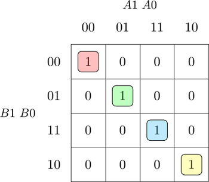

| **Dec. equivalent** | **B[1:0]** | **A[1:0]** | **B is greater than A** | **B equals A** | **B is less than A** |
| :-: | :-: | :-: | :-: | :-: | :-: |
 | 0 | 0 0 | 0 0 | 0 | 1 | 0 |
 | 1 | 0 0 | 0 1 | 0 | 0 | 1 |
 | 2 | 0 0 | 1 0 | 0 | 0 | 1 |
 | 3 | 0 0 | 1 1 | 0 | 0 | 1 |
 | 4 | 0 1 | 0 0 | 1 | 0 | 0 |
 | 5 | 0 1 | 0 1 | 0 | 1 | 0 |
 | 6 | 0 1 | 1 0 | 0 | 0 | 1 |
 | 7 | 0 1 | 1 1 | 0 | 0 | 1 |
 | 8 | 1 0 | 0 0 | 1 | 0 | 0 |
 | 9 | 1 0 | 0 1 | 1 | 0 | 0 |
 | 10 | 1 0 | 1 0 | 0 | 1 | 0 |
 | 11 | 1 0 | 1 1 | 0 | 0 | 1 |
 | 12 | 1 1 | 0 0 | 1 | 0 | 0 |
 | 13 | 1 1 | 0 1 | 1 | 0 | 0 |
 | 14 | 1 1 | 1 0 | 1 | 0 | 0 |
 | 15 | 1 1 | 1 1 | 0 | 1 | 0 |
 
 
 graterSOP/min= ()
 
 
 

## 2. 2-bit comparator 

### The K-map for the "equals" function is as follows:

### The K-map for the "less" function is as follows:

**rovnica:**
 
*  (B̅1+A1)*(B̅0+A1)*(B̅1+B̅0)*(A1+A0)*(B̅1+A0) * 

### The K-map for the "grater" function is as follows:

library ieee;
use ieee.std_logic_1164.all;

------------------------------------------------------------------------
-- Entity declaration for 2-bit binary comparator
------------------------------------------------------------------------
entity comparator_4bit is
    port(
        a_i           : in  std_logic_vector(4 - 1 downto 0);
        b_i           : in  std_logic_vector(4 - 1 downto 0);

        -- COMPLETE THE ENTITY DECLARATION
        
        B_greater_A_o    	: out std_logic;
		B_equals_A_o    	: out std_logic;
        B_less_A_o   	 	: out std_logic       -- B is less than A
    );
end entity comparator_4bit;

------------------------------------------------------------------------
-- Architecture body for 2-bit binary comparator
------------------------------------------------------------------------
architecture Behavioral of comparator_4bit is
begin
	B_greater_A_o   <= '1' when (b_i > a_i) else '0';
    B_less_A_o   	<= '1' when (b_i < a_i) else '0';
	B_equals_A_o    <= '1' when (b_i = a_i) else '0';

    -- WRITE "GREATER" AND "EQUALS" ASSIGNMENTS HERE

end architecture Behavioral;
Code of testbench.vhdl
library ieee;
use ieee.std_logic_1164.all;

------------------------------------------------------------------------
-- Entity declaration for testbench
------------------------------------------------------------------------
entity tb_comparator_4bit is
    -- Entity of testbench is always empty
end entity tb_comparator_4bit;

------------------------------------------------------------------------
-- Architecture body for testbench
------------------------------------------------------------------------
architecture testbench of tb_comparator_4bit is

    -- Local signals
    signal s_a           : std_logic_vector(4 - 1 downto 0);
    signal s_b           : std_logic_vector(4 - 1 downto 0);
    signal s_B_greater_A : std_logic;
    signal s_B_equals_A  : std_logic;
    signal s_B_less_A    : std_logic;

begin
    -- Connecting testbench signals with comparator_4bit entity (Unit Under Test)
    uut_comparator_4bit : entity work.comparator_4bit
        port map(
            a_i           => s_a,
            b_i           => s_b,
            B_greater_A_o => s_B_greater_A,
            B_equals_A_o  => s_B_equals_A,
            B_less_A_o    => s_B_less_A
        );

    --------------------------------------------------------------------
    -- Data generation process
    --------------------------------------------------------------------
    p_stimulus : process
    begin
        -- Report a note at the begining of stimulus process
        report "Stimulus process started" severity note;

        --0
        -- First test values
        s_b <= "0000"; s_a <= "0000"; wait for 100 ns;
        -- Expected output
        assert ((s_B_greater_A = '0') and (s_B_equals_A = '1') and (s_B_less_A = '0'))
        -- If false, then report an error
        report "Test failed for input combination: 0000, 0000" severity error;
        --1     
        s_b <= "0000"; s_a <= "0001"; wait for 100 ns;
        assert ((s_B_greater_A = '0') and (s_B_equals_A = '0') and (s_B_less_A = '1'))
